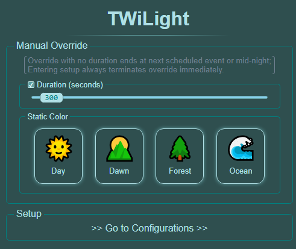
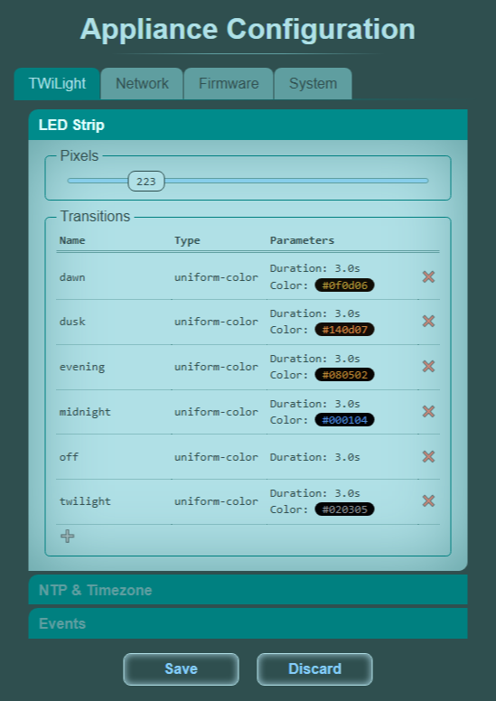
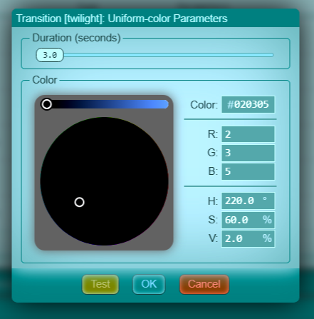
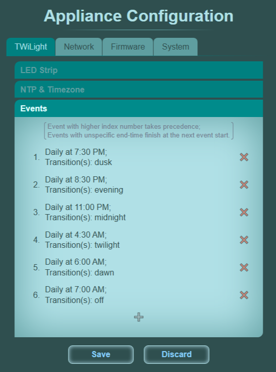
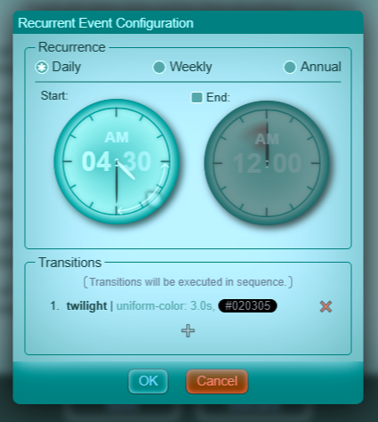

# TWiLight

Event-reactive lighting fixture using addressable LED strips.

Powered by [ESPZWApplianceT2](https://github.com/Adam5Wu/ESPZWApplianceT2) framework
and [ESPWS2812FBLess](https://github.com/Adam5Wu/ESPWS2812FBLess) LED driver.

## Features

* Time-based lighting schedule
  * Daily, weekly and annual recurring events
  * Native NTP, timezone and day-light saving support
* Butter-smooth transitioning
* Web configuration UI with convenient manual override
* (WIP) Configurable light-show effects
  * Color wipe / color wheel
  * (Future work) Water effects
* (WIP) Real-time event reactive via MQTT
  * [Astronomical events](https://github.com/Adam5Wu/MQServices/tree/main/AstroServ),
    e.g. actual day/night time of the site;
  * [Ethnic dates](https://github.com/Adam5Wu/MQServices/tree/main/TimeServ),
    e.g. Chinese calendar solar term dates;
  * [Weather conditions](https://github.com/Adam5Wu/MQServices/tree/main/WeatherServ);
  * and events [from other MQTT enabled devices](https://github.com/Adam5Wu/MQServices/tree/main/Transcriber).

## Screenshots

* Main page

  

* Strip setup

  

  - Uniform color transition configuration

    

* Events setup

  

  - Recurrent event configuration

    
